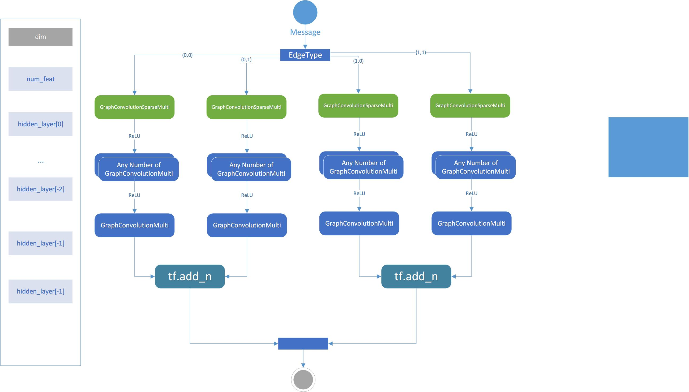

 # GCN-FOR-SYNERGY

原作者介绍在这里 [INTRO](intro.md)

## 环境配置

这个代码比较古老，使用的是早期版本的1.x的tf。

环境建议使用docker镜像`tensorflow/tensorflow:1.5.1-gpu-py3`
一键部署，不需要任何配置。
```shell script
docker pull tensorflow/tensorflow:1.5.1-gpu-py3
```
否则需要手动安装的包列表如下：
+ tensorflow1.x
+ scipy
+ sklearn

## 0.概述
main.py 是一个训练模型的demo，指明了这个项目大致上的工作流程：
1. 设置GPU
2. 将所有参数放置在字典 [Model_Parameters] 中 （注意，所有默认值等都直接在这里修改，不要动下面的代码）
3. 预处理数据 *由于没有数据字典，所以很多重要的对象只能靠猜测*
4. 生成placeholder和FLAGS *placeholdrs是一个字典，包括一些超参数、邻接矩阵、度矩阵、特征向量等一切用到的Tensor*
5. 构建minibatch iterator、模型和优化器 (*重点展开*)
6. 训练和评估模型

其中，第五步的几个对象是复用重点，对其的理解依赖于第四步的placeholder，而
这些placeholder由第三步的预处理导出。所以这部分笔记我会从
第五步的几个类出发，追溯到它涉及的预处理。由于元数据完全没有，
所以不去探究具体的预处理和placeholder意义。

通过通读 main 文件，大致认为要复用这个项目，可以利用作者的main文件，以之
为基础进行二次开发。下一章先不谈论模型核心，分析main的复用重点。

## 1.参数和变量反推——对Placeholder和FLAGS的分析
`FLAGS`是Tensorflow中简化命令行参数的一个机制。分析FLAGS得出通过命令行
传参，用户可以轻松定义如下几个内容：

|参数名|默认值|解释|
| --- | --- | --- |
| learning_rate | 0.001 | Initial learning rate|
| batch_size|20|minibatch size|
| Max_epoch|2|Max epoch|
| dropout|0.2|Dropout rate|
| bias | True | Bias term|
| weight_decay|0|Weight for L2 loss on embedding matrix|
| l2 | 1 | l2|
| max_margin|0.1|Max margin parameter in hinge loss|

### placeholders的定义
TODO 研究中

|命名|类型|默认值|说明|
| --- | --- | --- | --- |
|batch|int32||
|batch_neg|int32||
|batch_pos_s|float32||
|batch_neg_s|float32||
|batch_edge_type_idx|int32||
|batch_row_edge_type|int32||
|batch_col_edge_type|int32||
|degrees|int32||
|dropout|int32|0|drooput|
|adj_mats_%d,%d,%d|sparse| |每一种edgetype三元组对应的邻接矩阵|
|feat_%d|sparse| |每一种edgetype二元组对应的feature矩阵(不懂)|

### 反推的数据字典
总体而言就是从数据集读取数据后进行预处理生成一些数据结构。

没有真正的数据字典分析数据的意义是没有价值的，所以主要分析每个对象的抽象特征
比如矩阵的size、label和dataset的对应关系等。

暂时已经得出的结论:

+ 有38种drug, 39种cell line

#### 矩阵
不做特殊说明,所有矩阵均为scipy的csr_matrix稀疏矩阵对象

|main中的对象名|size|说明|
| --- | --- | --- |
|cel_adj|39*39|应该是描述cell和cell关系图的邻接矩阵,值含义未知|
|cel_drug_adj|39*38|应该是描述cell和drug关系图的邻接矩阵,值含义未知|
|drug_cel_adj|38*39|应该是描述drug和cell关系图的邻接矩阵,值含义未知|
|drug_drug_adj|38*38|是一个列表,共39项,每一项是一个38*38的csr,第i项就是index为i的cell line上两种药物是否协同作用超过阈值,是为1否则0|


#### 其他对象

`labels`：OrderDict
>key = `drug a name`\_`drug b name`\_`cell line`描述一组关联
>
>value = [`synergy`, `fold`] 描述关联的协同作用（float）和未知意义fold

`all_drugs`: list
>所有的 drug name 的集合

`n_drugs`: int
>drug name的个数

`idx_drugs`: dict
>根据`all_drugs`生成的 { 名字 : 下标 }的映射

`cellLine`: sset
>所有cell line的集合

`n_cel`: int
>cell line的个数

`idx_cellLine`: dict
>根据`cellLine`生成的 { 名字 : 下标 }的映射

`labels_for_reg`: dict
> key: int，cellline对应的index
>
> value: dict
>> key: (`idx of drug a`, `idx of drug b`)
>>
>> value: enum(float)
>>> 1.0 = synergy_score > threshold
>>>
>>> 0.0 = synergy_score <= threshold
>>>
>>> threshold是`Model_Parameters`中保存的超参数，推测应该是协同作用的阈值
>>> 这个字典，先检索cell的index，再检索两种药物的index，最后得到这一组
>>> 关联的协同作用是否超过阈值。
>>> 需要注意的是，不仅可以通过`idx_cellLine[cel]`来查询到某一个cell，也可以通过`idx_cellLine[cel]+n_cel`来查询。有点迷

`drug_drug_adj_list`: list int[][][]
>三维数组. `drug_drug_adj_list`[`cell index`][`drug a index`][`drug b index`] = 1 if 这一组关联的协同作用>=threshold else 0

`folds`: dict 按照fold归档关联组
> key: str 就是labels的分析中的folder值
>
> value: list 对应fold中所有的关联组(labels的key)

`[tra|val|test]_edges_[t|f]`: dict 边数据集
> tra val test 表示train validate test
>
> key: cell index或者cell index + `n_cel`
>
> value: list of [drug a index, drug b index]
>
>> t 结尾的数据集, 包含的药物对会达到threshold
>>
>> f 结尾的数据集, 包含的药物对不会达到threshold

`cell_info`: OrderedDict
> key: cell name
> value: 3984d nparray 特征向量后续从这里计算出

`cell_feat`: tuple
>比较复杂的一个tuple, cell的feature, 应该后续做训练的时候会去做进一步解析

`cel_nonzero_feat` = `n_cel`

`cel_num_feat`: int 特征数

`drug_info`: OrderedDict
> key: drug name
> value: list len = 4387 特征向量后续从这里计算出

`drug_feat`: tuple
> 组织结构很类似`cell_feat`

`drug_nonzero_feat` = `n_drugs`

`drug_num_feat`: int =2430 特征数

`cel_degrees`: ndarray, 表示每一种cell节点的度

`drug_degrees_list`: list of ndarray
> `drug_drug_adj`中的每一个邻接矩阵中,每种drug节点的度

#### Data representation
这里貌似是对之前预处理的数据的二次封装,还是没有任何注释和文档,只能猜.

总而言之这一部分就是做了很多字典. 字典的key可以是int(0或1)也可以是
长度为2的tuple(两个值也都是1)
0的意思是cell, 1的意思是drug.

(0,1) (1,1)这种tuple就是`edgetype`
>edgetype是这个项目的核心概念.有两种表示方式,一种是类似(0,1), (1,1)
>这样的二元组,表示宏观上cell->drug或drug->drug等联系, 而还有一种是
>类似(1,1,12)这样的三元组,主要出现在drug->drug中,第三个值是对应的cell_index.

1 0这样的是`nodetype`

通过这些字典,使用type查找相应的数据

但是好多地方作者做了奇怪的操作,不是很清楚,先保留疑问记录在下面

`adj_mats_orig`
> key是tuple, 检索出对应邻接矩阵.
>
> 每一种edgetype对应的邻接矩阵数量不尽相同, 生成的方法也千奇百怪,**这里不懂**

`degrees`
> 两种degree的处理都很迷

`num_feat` `nonzero_feat` `feat`: 普通的检索

`edge_type2dim`: 四种edgetype邻接矩阵的shape

`edge_type2decoder`: 应该是解码数据用的算法

`edge_types`: 每种edgetype邻接矩阵的数量

`num_edge_types` 邻接矩阵数量总和

`edge_type2idx`: dict
> key 3tuple 前两位是edgetype, 第三位表示这个edgetype中的第几个
>
> value idx edgetype三元组映射到的唯一index

`idx2edge_type`: OrderedDict
> key edgetype的index
> value 一些边的集合, (1,1)的edgetype应该能映射到所有的边上去(list of [src, dest])
> 其余三种没看懂.

`idx2name`: dict
> key edgetype的index
> value 如果是(1,1)那么是它对应的cell line的名字,否则是它对应的edgetype三元组.


 ## 2.EdgeMinibatchIterator分析
 阅读源码首行注释：
 >This minibatch iterator iterates over batches of 
    sampled edges or random pairs of co-occuring edges.
    assoc -- numpy array with target edges
    placeholders -- tensorflow placeholders object
    batch_size -- size of the minibatches

> 这个iterator比较发杂,也缺少文档,暂时先分析构造参数

#### 构造参数
基本都是上面原封不动的对象.
```python
from main import *
minibatch = EdgeMinibatchIterator(
    adj_mats=adj_mats_orig,
    feat=feat,
    edge_types=edge_types,
    batch_size=FLAGS.batch_size,
    val_test_size=Model_Parameters['val_test_size'], # 0.2 for drug-cel and cel-cel
    nsz_fold=Model_Parameters['Negative sample size'], # 30
    tra_f=tra_f_no_et,
    test_edges_f=test_edges_f,
    test_edges_t=test_edges_t,
    val_edges_f=val_edges_f,
    val_edges_t=val_edges_t,
    tra_edges_t=tra_edges_t,
    tra_edges_f=tra_edges_f,
    labels_for_reg=labels_for_reg,
    edge_type2idx=edge_type2idx,
    idx2edge_type=idx2edge_type,
    iter_len=sum(edge_types.values()),
)
```

## 3.DecagonModel分析
这部分只分析宏观上的模型结构,各种Layer放在下一部分
#### 构造参数
```python
from main import *
model = DecagonModel(
    placeholders=placeholders,
    num_feat=num_feat,
    nonzero_feat=nonzero_feat,
    edge_types=edge_types,
    hidden_layer=Model_Parameters['hidden layer'], # [2048,1024]
    l2=FLAGS.l2,
    decoders=edge_type2decoder,
)
```
所有的隐藏层容器都是一个dict, tuple->list. key是edgetype二元组, value是
对应的edgetype的若干隐藏层

对于每一种edgetype, 输入的特征维度是num_feat, 经过一层`GraphConvolutionSparseMulti`
输出维度`hidden_layer[0]`接下来经过若干个`GraphConvolutionMulti`
输出维度分别为`hidden_layer[:-1]`,最后一层embeddding层也是`GraphConvolutionMulti`
输出维度`hidden_layer[-1]`

到此为止一直是四路并行的,存储的数据结构是2*2的列表或字典

最后(0,x)求和,(1,x)求和,就是最终的embedding,数据结构是长度2的列表.

除了到embedding的一组GCN单元.
每种edgetype对应不同的decoder, 分别是`InnerProductDecoder`, `DistMultDecoder`, 
`BilinearDecoder`, `DEDICOMDecoder`, imput_dim是`hidden_layer[[-1]`
输出不论这种edgetype二元组中有多少种num_type, 都是输出一个tensor. 也就是说, 最终
就是按照四种edgetype decode出四个tensor. 这个tensor维度需要仔细分析Layer才能得出,
存储decoder的数据结构是一个字典,key是edgetype二元组,value是对应的decoder.对象名`edge_type2decoder`

另外, 根据decoder的不同, 每种edgetype二元组还能对应一组`latent_inters`和`latent_varies`
从Model的代码中只发现进行了初始化为两个矩阵, 具体等待后续研究.

## 4.DecagonOptimizer分析
### 获取Node Embedding的流程

根据上一部分对Model的分析,可以画出Model的流程图



### 构造参数
```python
from main import *
with tf.name_scope('optimizer'):
    opt = DecagonOptimizer(
        embeddings=model.embeddings, # 
        latent_inters=model.latent_inters,
        latent_varies=model.latent_varies,
        degrees=degrees,
        edge_types=edge_types,
        edge_type2dim=edge_type2dim,
        placeholders=placeholders,
        batch_size=FLAGS.batch_size,
        margin=FLAGS.max_margin,
        neg_sample_weights=Model_Parameters['Neg_sample_weights'], # 1
        LOSS=Model_Parameters['LOSS'], # Cross-entropy
    )
```
optimizer中用到了数据结构`latent_inters`和`latent_varies`应用于某种算法,但是
由于文档缺失我单看代码不是很能理解这种算法.
## 5.Layer分析
TODO